# Exercise

## Step 1: Set Up the GitHub Repository

- Configure GitHub for our repository to enable sharing.

## Step 2: Allow Cloning for Another Collaborator

- Invite our classmate, David Alegria.

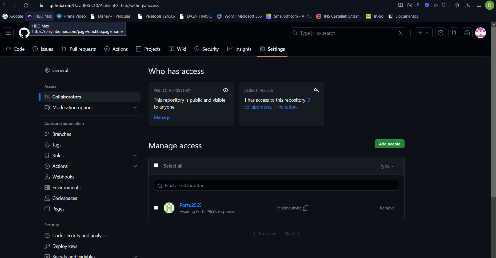

## Step 3: Clone the Repository Locally

- Download Git Extensions.

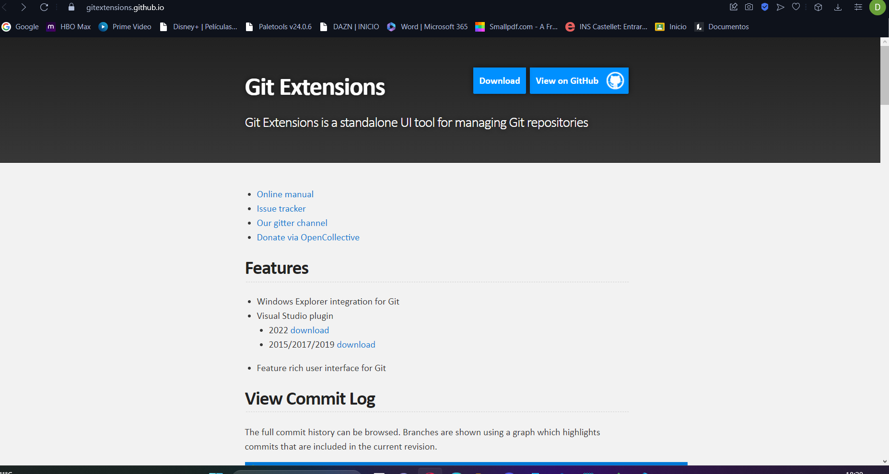

- Once inside the application, go to "Clone Github repository."

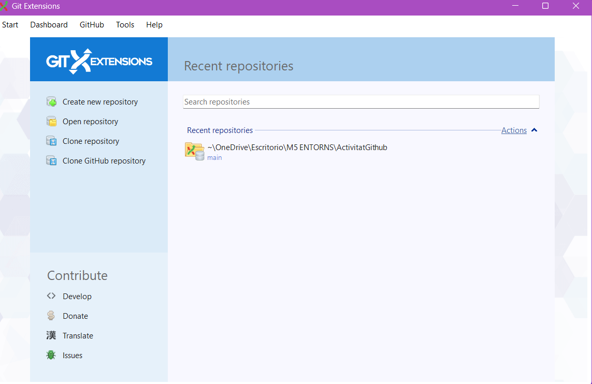

- Enter the repository information. To do this, obtain an access token, copy the link, and then clone the repository using Gitextensions.

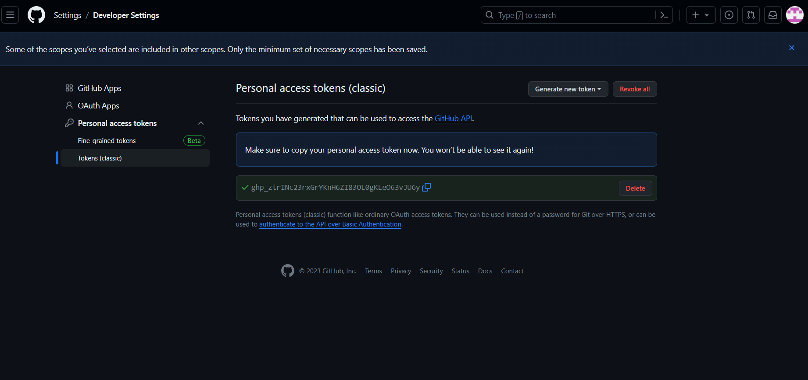

- Choose our file (ActivitaGitHub) and clone it.

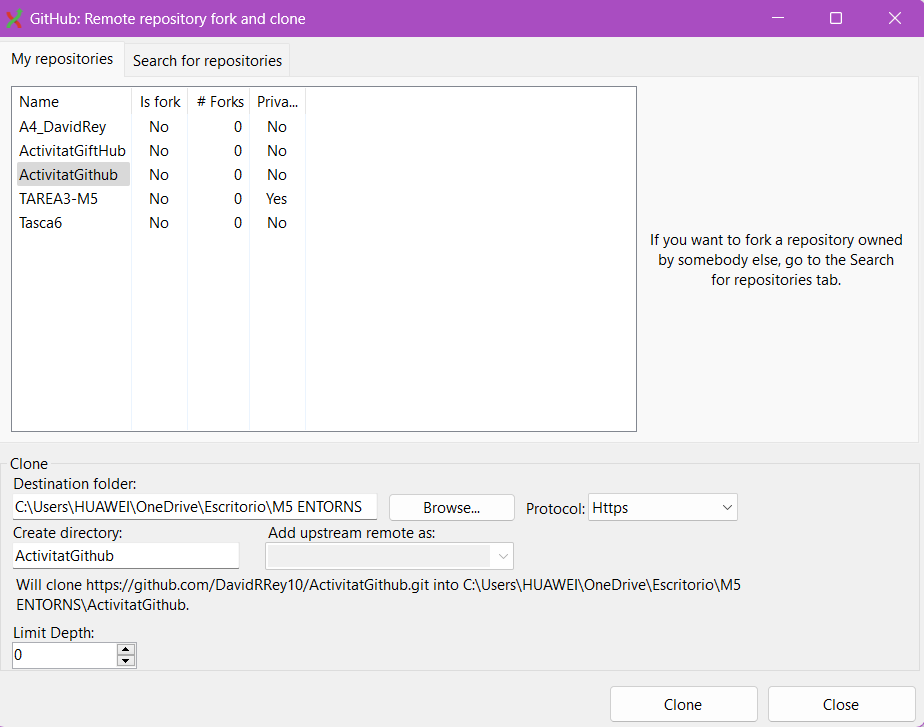

- Choose the location where you want to place your copy.

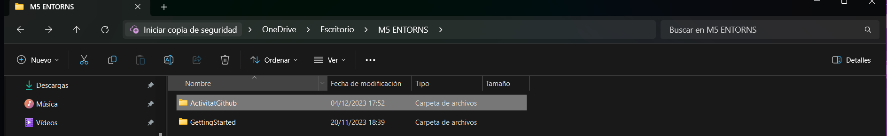
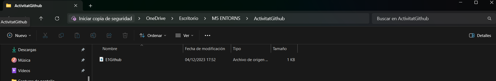

- At this point, we will have the cloned file.

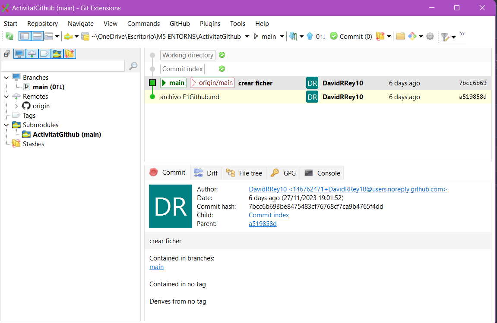

## Step 4: Add E2Contributing.md File

- Create a file `E2Contributing.md` and document the steps.
- Create the Markdown document in our copy of the file (ActivitatGithub) and document the process.

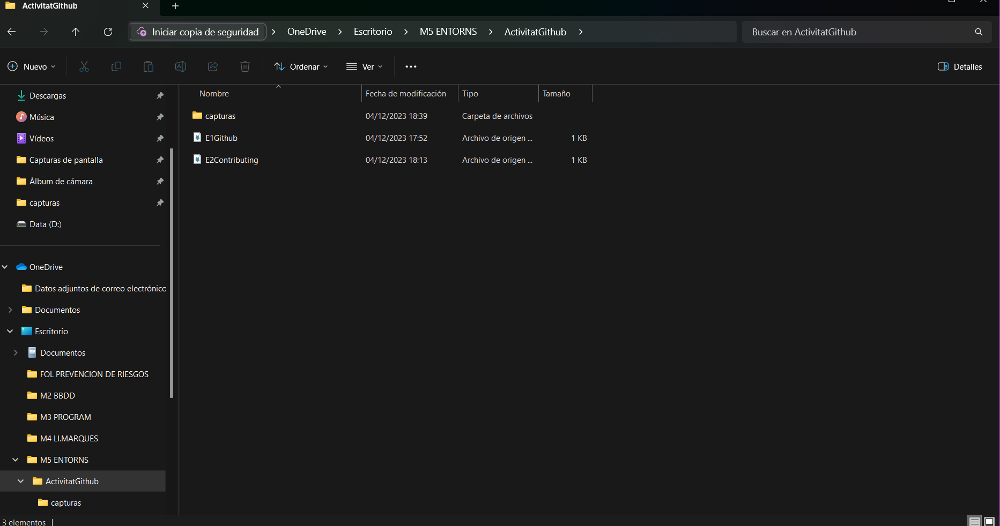

## Commit and Push the Changes

- Commit the changes by clicking the commit button on the top toolbar.

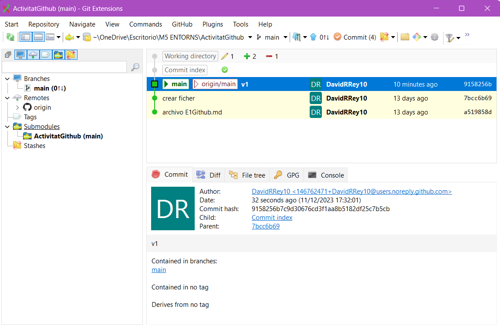

- The files to be committed will be displayed. Click "Commit and Push" and enter "v1" in the commit message box.

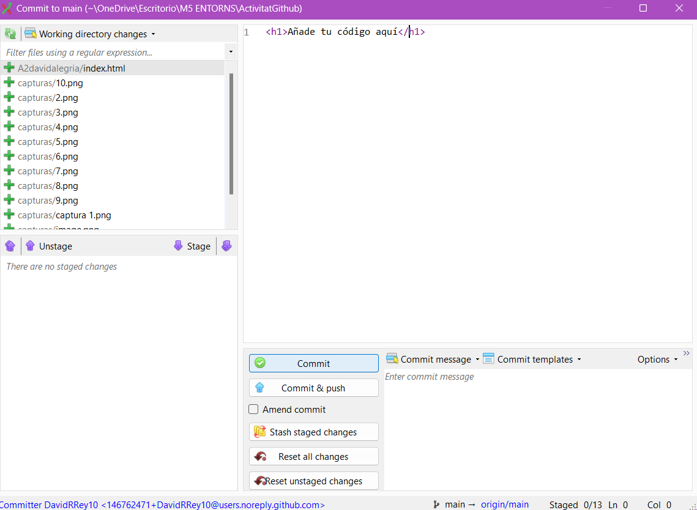
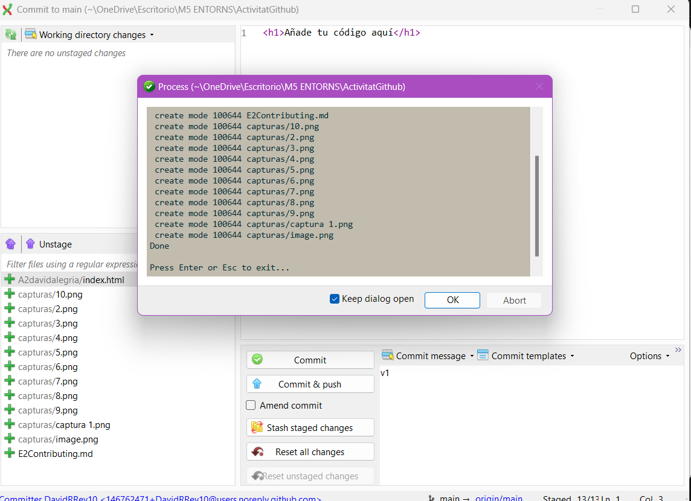